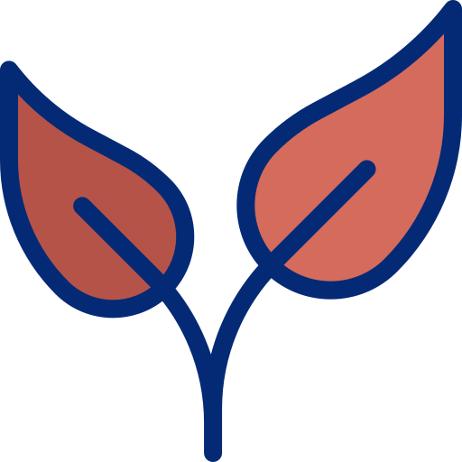
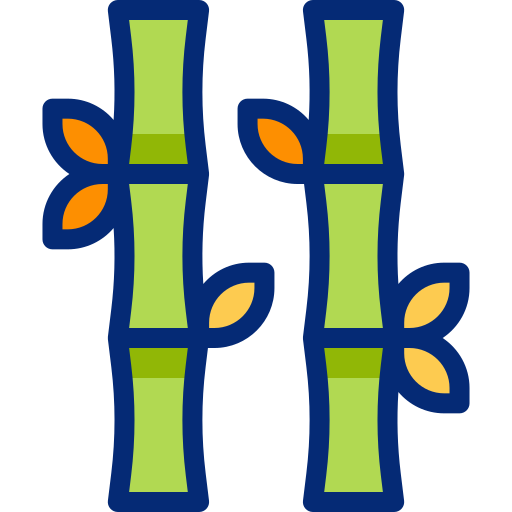

# Hello world :)

### Projeto CPW1: currículo em HTML, CSS and JavaScipt:
Aqui, você pode encontrar os projetos de um currículo em HTML, contendo um Menu Inicial com as seguintes opções:
- Início
- Projetos
- Contatos

As respectivas páginas em HTML do projeto do currículo, estão estilzadas com CSS e a parte das interações e funcionalidades mais complexas das páginas ainda estão em processo de construção, onde o JavaScript será a nossa Linguagem de Programação.

  <h2> Projetos: </h2>
<article>
    <h3> Projeto 1: Portifólio </h3>

    <p>Descrição do projeto: Neste projeto, elaborei um prtifólio de projetos da disciplina
        de Construção de Páginas Web. Utilizei as seguintes ferramentas: HTML, CSS e estou aprimorando
        com a Linguagem de Programação: JavaScript. 
    O objetivo do projeto é criar além de currículo, um espaço para projetos e contatos.  </p>
</article>

<article>
   <h3> Projeto 2: Página de porjetos </h3>
    
   <p>Descrição do projeto: A página de projetos surge da necessidade de unir os projetos criados fora e dentro do
    ambiente acadêmico afim de exercitar as habilidades aprendidas em sala de aula e em outros espaços de aprendizado
no que tange a área da tecnologia. </p>
</article>


`var a = 1`

```js
if a > 2 
    return "maior"
```
